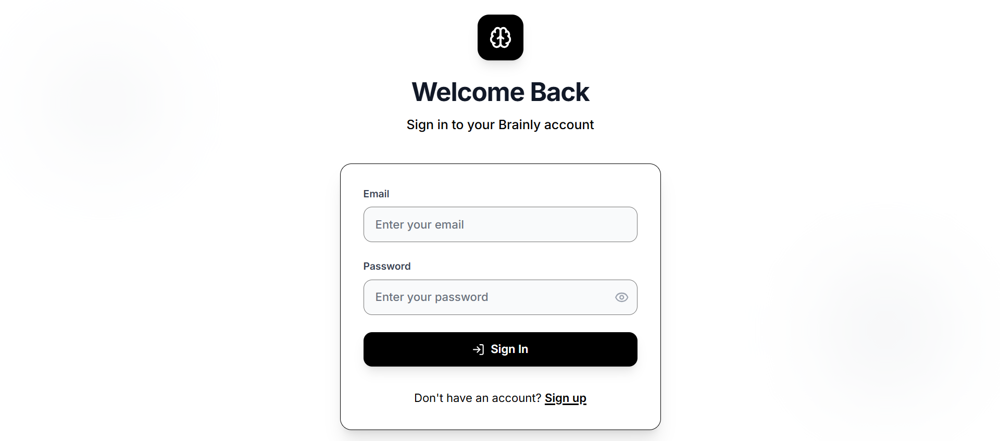
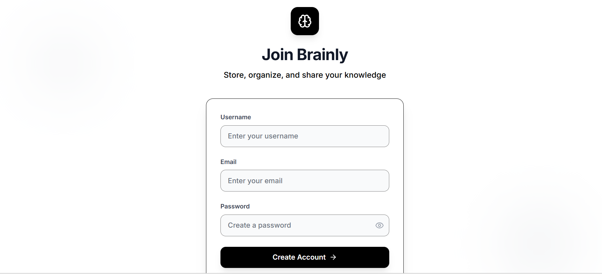
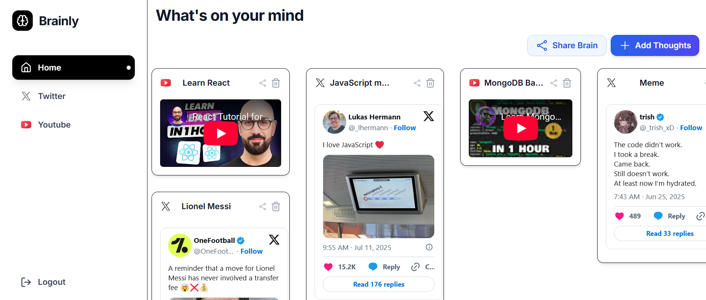
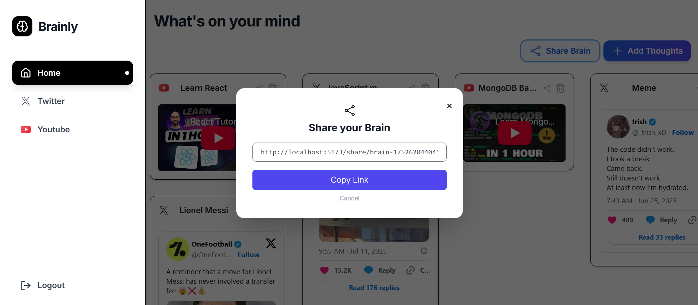
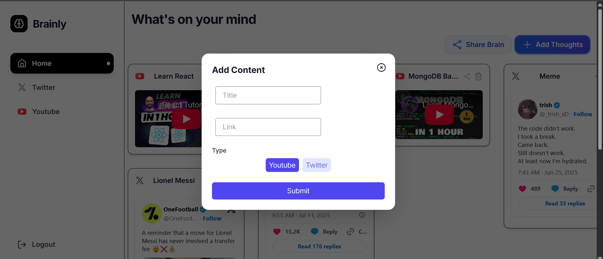
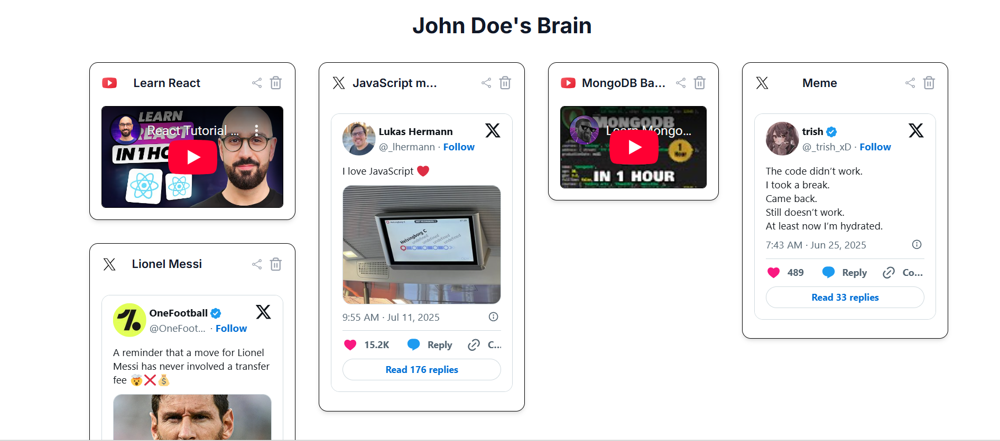

# Brainly - Social Content Aggregation Platform

A modern web application for aggregating and sharing content from various social media platforms like Twitter and YouTube. Built with React, TypeScript, and Vite.

## 🔗 Links

- **Live Website**: [Live Website](https://brainly-fe-v2.vercel.app/)
- **Backend Repository**: [Brainly Backend](https://github.com/Priyanshu1-0/brainly)


## 🖼️ Screenshots

### Authentication Pages

*User sign-in interface with email and password fields*


*User registration page with form validation*

### Main Application

*Main dashboard showing content cards from Twitter and YouTube*

### Modals and Interactions

*Modal for sharing brain content with others*


*Modal for adding new thoughts and content*

### Shared Brain View

*View other people's thoughts*

## ✨ Features

- **Multi-Platform Content**: Aggregate content from Twitter and YouTube
- **Modern UI**: Clean, responsive design with Tailwind CSS
- **Content Management**: Add, share, and organize your thoughts
- **Real-time Updates**: Dynamic content loading and updates
- **User Authentication**: Secure sign-in and sign-up functionality
- **Responsive Design**: Works seamlessly on desktop and mobile

## 🚀 Getting Started

### Prerequisites

- Node.js (v16 or higher)
- npm or yarn

### Installation

1. Clone the repository:
```bash
git clone https://github.com/Priyanshu1-0/brainly-fe-v2.git
cd brainly-frontend
```

2. Install dependencies:
```bash
npm install
```

3. Start the development server:
```bash
npm run dev
```

4. Open your browser and navigate to `http://localhost:5173`


## 🛠️ Tech Stack

- **Frontend**: React 18 with TypeScript
- **Build Tool**: Vite
- **Styling**: Tailwind CSS
- **Icons**: Custom SVG icons
- **State Management**: React Hooks
- **Routing**: React Router

## 📁 Project Structure

```
src/
├── components/          # Reusable UI components
│   ├── icons/          # SVG icons
│   └── ui/             # UI components (Button, Card, Modal, etc.)
├── hooks/              # Custom React hooks
├── pages/              # Page components
├── config.ts           # Configuration files
└── main.tsx           # Application entry point
```

## 🎨 UI Components

The application features a modern, clean interface with:

- **Sidebar Navigation**: Easy access to different sections
- **Content Cards**: Beautiful cards displaying social media content
- **Modal Dialogs**: Smooth interactions for content creation
- **Responsive Grid**: Adaptive layout for different screen sizes

## 📱 Responsive Design

The application is fully responsive and optimized for:
- Desktop (1024px+)
- Tablet (768px - 1023px)
- Mobile (320px - 767px)

## 🔧 Development

### Available Scripts

- `npm run dev` - Start development server
- `npm run build` - Build for production
- `npm run preview` - Preview production build
- `npm run lint` - Run ESLint

### Code Style

This project uses:
- TypeScript for type safety
- ESLint for code linting
- Prettier for code formatting

## 📸 Adding Screenshots

To add your own screenshots:

1. Take screenshots of your application
2. Save them in the `docs/images/` directory
3. Update the image paths in this README
4. Use descriptive filenames (e.g., `dashboard.png`, `mobile-view.png`)

### Screenshot Guidelines

- **Resolution**: Use high-resolution screenshots (1920x1080 or higher)
- **Format**: PNG or JPG format
- **Naming**: Use descriptive names with hyphens (e.g., `main-dashboard.png`)
- **Size**: Optimize images for web (under 1MB when possible)

## 🤝 Contributing

1. Fork the repository
2. Create a feature branch (`git checkout -b feature/amazing-feature`)
3. Commit your changes (`git commit -m 'Add amazing feature'`)
4. Push to the branch (`git push origin feature/amazing-feature`)
5. Open a Pull Request


**Note**: Replace the placeholder image paths with your actual screenshot files once you've added them to the `docs/images/` directory.
